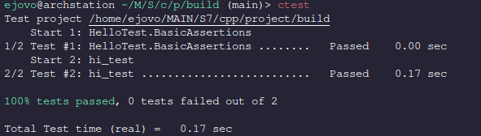

# All Star World Cup

### Building

This project is built using CMake.

```
git clone git@github.com:ejovo13/world_cup_all_star.git
cd world_cup_all_star
mkdir build && cd build
cmake ../                # Configuration
cmake --build ./ -j4     # Compilation
```

### Executing

As of this commit, the executable `load_teams` will be created in `${CMAKE_BINARY_DIR}/src`. 
```
cd src        # assuming we are in world_cup_all_star/build
./load_teams
```

### Test Suite

We use GoogleTest which seamlessly integrates with CMake. Tests can be called with `ctest` from the build directory:

```
ctest
```




### Todo

The core simulation and bracket running of our project has already been implemented:

1. Load team data
2. select top 32 + 16 random invitees
3. Create 12 pools of 4
4. Simulate pool games
5.
6. 
7. Run bracket 

Here's what we still have to implement:

- [ ] Select the two winners of each pool (How do we decide between two teams with the same record??)
- [ ] Select the top 8 teams to have a bye-week (ou ils jouent pas la premiere manche)
- [ ] Add more unit tests. I'd like to test the simulation aspect of the game.

And some executive decisions that we have to make

- [ ] Should the home/away distinction matter? In the Kaggle data set the home team performs FAR BETTER than the away team. Should we take this into account? Currently the `goals_per_minute()` function uses the _combined_ average of a teams home and away performance so as not to skew the results of a match. Is that what we want?
- [ ] Are you happy with the bracket system? 12 pools of 4 -> keep top 2 (24 teams) -> 16 teams round 2 and 8 teams with a bye -> 16 teams for round 2

Once that's done the core of our project is literally complete and we can implement _whatever_ else we want.

Some ideas 

- [ ] Outputting the results of the bracket to an .svg image (ez)
- [ ] Implement some sort of gambling game where you try to guess the results (In the US we "make brackets")
- [ ] Run thousands of simulations and come up with really cool data visualizations