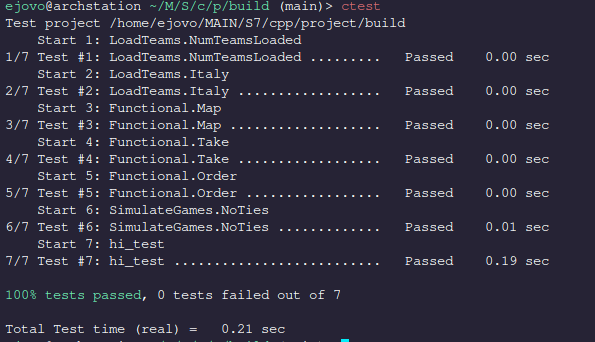

# All Star World Cup

### Building

This project is built using CMake.

```
git clone git@github.com:ejovo13/world_cup_all_star.git
cd world_cup_all_star
mkdir build && cd build
cmake ../                # Configuration
cmake --build ./ -j4     # Compilation
```

### Executing

The executable `all_star_game` will be created in `${CMAKE_BINARY_DIR}/src`. To launch the game, simply execute the following command:
```
./src/all_star_game
```

### Test Suite

We use GoogleTest which seamlessly integrates with CMake. Tests can be called with `ctest` from the build directory:

```
ctest
```



